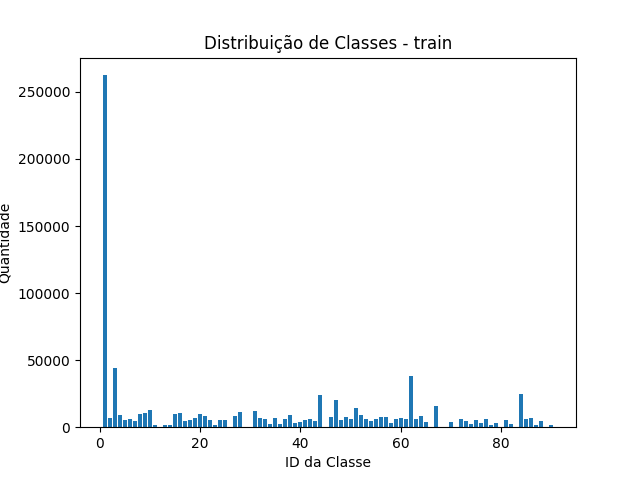
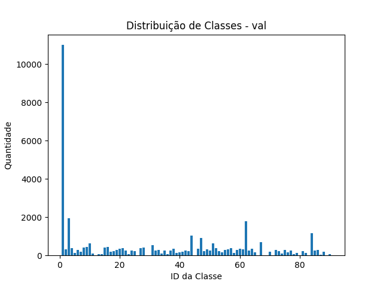
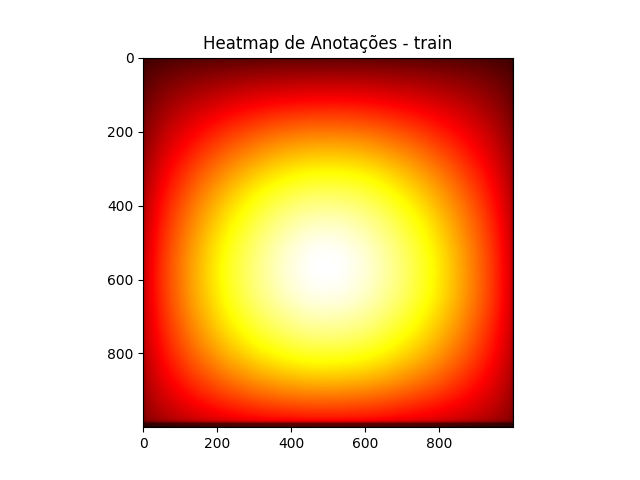
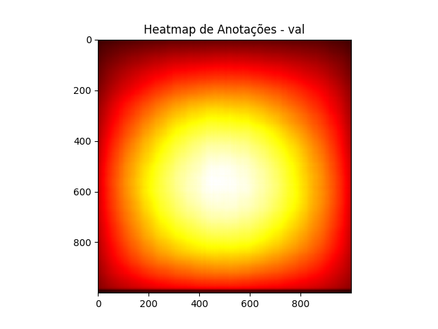

# Research on YOLO Model Selection Based on Dataset Characteristics

## Overview

In object detection research, YOLO (You Only Look Once) models are widely used across various versions (v3, v5, v7, v9,...). However, most comparisons between these models rely on ad-hoc methodologies, often selecting a few versions arbitrarily, training them on a dataset (typically COCO), and comparing results. This approach is inefficient in terms of computational resources, time, and reproducibility.

This research aims to establish a **clear methodology for selecting the optimal YOLO model based on dataset characteristics**. Instead of blindly comparing models, we will use measurable dataset attributes to guide model selection before initiating training, optimizing resource allocation and enhancing scientific rigor.

---

## Objectives

1. **Analyze Dataset Characteristics**  
   - Evaluate dataset health, including metrics such as annotation consistency, image dimensions, and representativeness.

2. **Create Dataset Variants**  
   - Generate controlled modifications of the COCO dataset, including changes in:
     - Number of classes  
     - Class distribution  
     - Number of instances per class  
     - Object spatial distribution within images  

3. **Evaluate YOLO Model Performance Across Variants**  
   - Train multiple YOLO versions (e.g., YOLOv3, YOLOv5, YOLOv7, YOLOv9) on the dataset variants.  
   - Measure and compare performance metrics.

4. **Develop a Model Selection Methodology**  
   - Correlate dataset characteristics with YOLO model performance.  
   - Propose a methodology for selecting the best YOLO version based on dataset attributes.

---

## Methodology

### 1. **Dataset Diagnosis**
- Perform a health check on the dataset, including:
  - Number of images
  - Number of annotations
  - Average image size
  - Median image ratio
  - Number of missing annotations
  - Number of null annotations
  - Object count histogram
  - Heatmap of annotation locations

**Example Outputs from Dataset Health Checker:**

| **Class Distribution (Training Dataset)** | **Class Distribution (Validation Dataset)** |
|-------------------------------------------|--------------------------------------------|
|  |  |

| **Heatmap of Object Annotations (Training Dataset)** | **Heatmap of Object Annotations (Validation Dataset)** |
|------------------------------------------------------|-------------------------------------------------------|
|  |  |

### 2. **Dataset Variants Creation**
- Generate variants of the COCO dataset by modifying:
  - **Number of Classes:** Subsets with 10, 20, 40, and 80 classes.  
  - **Instance Distribution:** Uniform distribution vs real-world unbalanced distributions.  
  - **Instance Density per Image:** Sparse images vs dense object clusters.  
  - **Spatial Distribution of Objects:** Objects concentrated in one area vs uniformly distributed across the image.

### 3. **Model Training and Evaluation**
- Train YOLOv3, YOLOv5, YOLOv7, YOLOv9, and others on each dataset variant.
- Record performance metrics:
  - Mean Average Precision (mAP)
  - Precision
  - Recall
  - Inference Speed (FPS)
  - Training Time
  - GPU/Memory Usage

### 4. **Correlation Analysis**
- Evaluate the relationship between dataset characteristics and model performance using statistical techniques such as:
  - ANOVA  
  - Tukey's HSD Test  
  - Regression Models

### 5. **Framework Development**
- Develop a reproducible pipeline to recommend the best YOLO version based on dataset diagnostics.

---
## Metrics

### 1. **Class Distribution Metrics**

#### 1.1. Entropy of Class Distribution  
Measures the uniformity of the distribution of objects across classes.

**Equation:**  
$$H = -\sum_{i=1}^{n} p_i \log(p_i)$$

Where:  
- \( H \): Entropy  
- \( p_i \): Proportion of class \( i \)  
- \( n \): Total number of classes  

- **High Entropy:** Uniform distribution across classes.  
- **Low Entropy:** Significant class imbalance.

#### 1.2. Gini Index  
Measures inequality in the class distribution.

**Equation:**  
$$G = 1 - \sum_{i=1}^{n} (p_i)^2$$

Where:  
- \( G \): Gini Index  
- \( p_i \): Proportion of class \( i \)  

- **Low Gini:** High inequality (one class dominates).  
- **High Gini:** Balanced distribution.

#### 1.3. Standard Deviation of Instances per Class  
Measures the dispersion of object counts per class.

**Equation:**  
$$\sigma = \sqrt{\frac{\sum (x_i - \bar{x})^2}{N}}$$

Where:  
- \( \sigma \): Standard Deviation  
- \( x_i \): Number of instances in class \( i \)  
- \( \bar{x} \): Mean number of instances across all classes  
- \( N \): Total number of classes  

### 2. **Spatial Distribution Metrics**

#### 2.1. Entropy of Object Locations  
Measures the randomness of object placement across the image grid.

**Equation:**  
$$H = -\sum_{i=1}^{n} p_i \log(p_i)$$

Where:  
- \( p_i \): Proportion of objects in grid cell \( i \)  
- \( n \): Total number of grid cells  

- **High Entropy:** Uniform object distribution.  
- **Low Entropy:** Clustered object distribution.

#### 2.2. Standard Deviation of Object Centers  
Measures how spread out object centers are across the image.

**Equation:**  
$$D = \sqrt{\sigma_x^2 + \sigma_y^2}$$

Where:  
- \( \sigma_x \): Standard deviation of object center x-coordinates  
- \( \sigma_y \): Standard deviation of object center y-coordinates  

- **Low \( D \):** Objects are clustered in specific regions.  
- **High \( D \):** Objects are evenly distributed across the image.

#### 2.3. Distance from Center of Mass  
Measures the average distance of object centers from the image center.

**Equation:**  
$$D_{cm} = \sqrt{(x_{cm} - x_{img})^2 + (y_{cm} - y_{img})^2}$$

Where:  
- \( x_{cm}, y_{cm} \): Center of mass of object centers  
- \( x_{img}, y_{img} \): Center of the image  

- **Low \( D_{cm} \):** Objects concentrated near the center.  
- **High \( D_{cm} \):** Objects spread away from the center.

---

## Current Tools

1. **Dataset Conversion Tool:** Converts the original COCO dataset into YOLO TXT format.  
2. **Dataset Health Evaluation Tool:** Analyzes dataset quality, including annotation completeness, image dimensions, object count distribution, and spatial distribution heatmaps.
